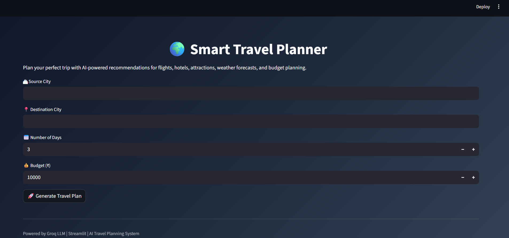
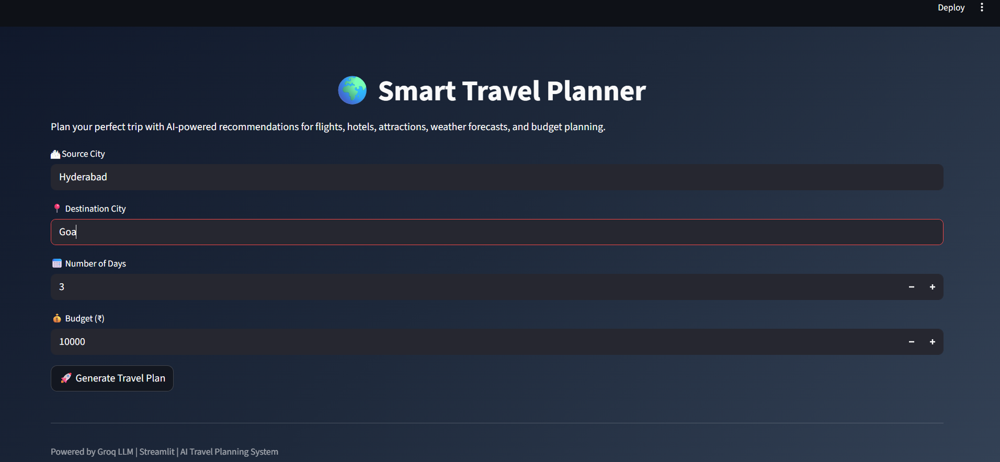
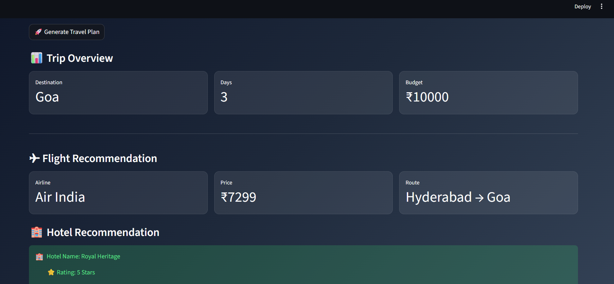
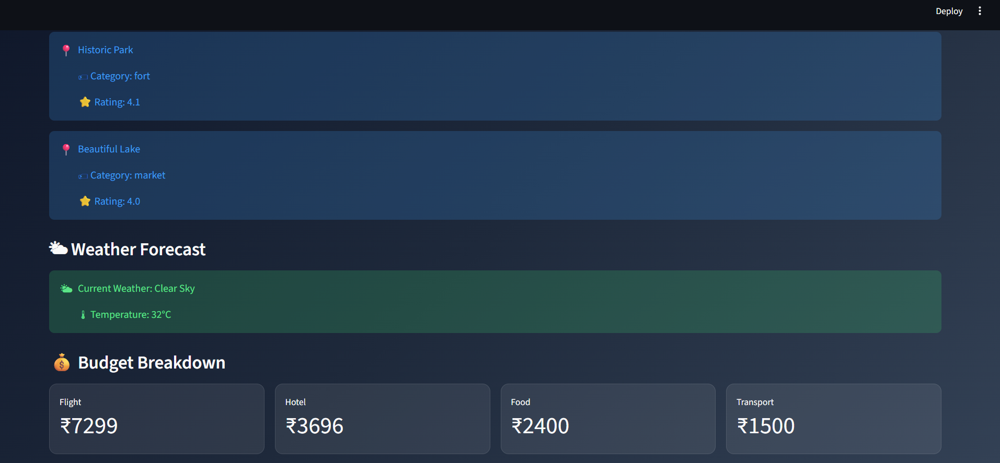
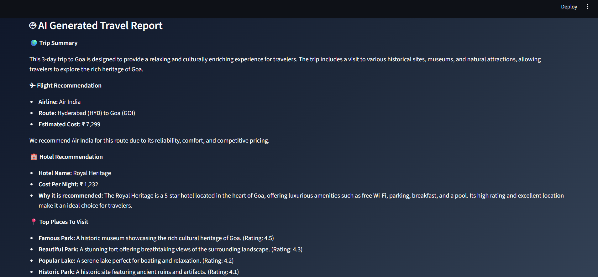
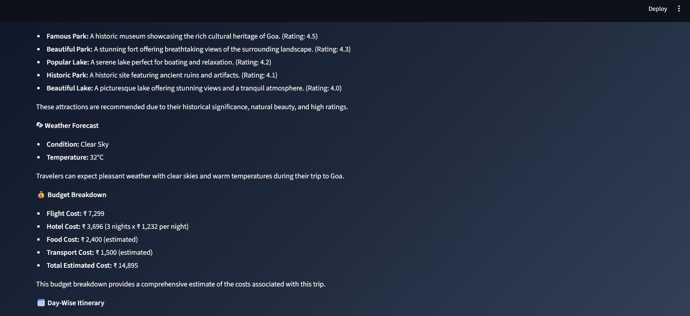
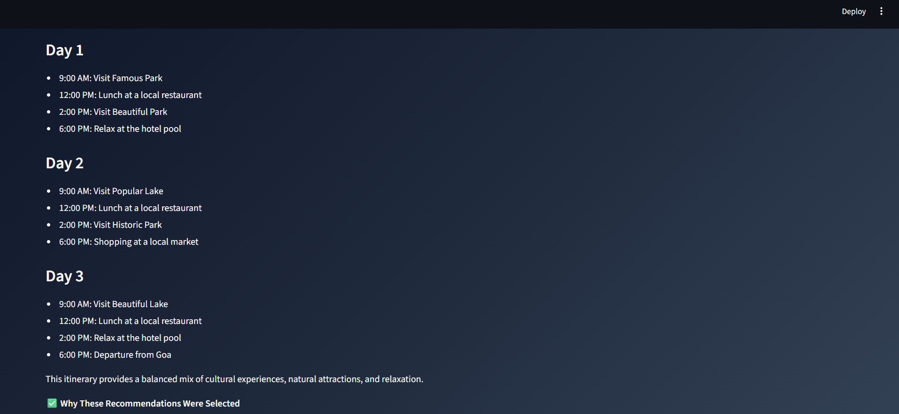
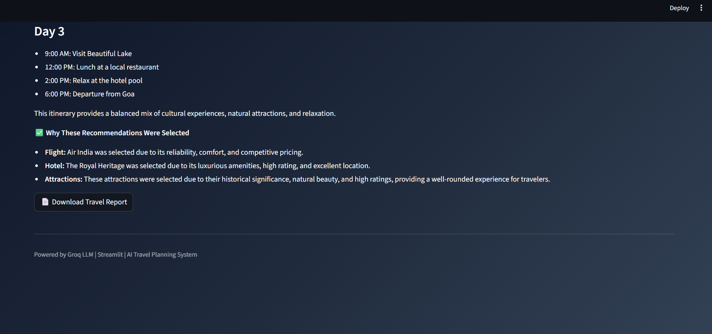

# 🌍 Smart Travel Planner

An AI-powered travel planning assistant developed using Python, Streamlit, and Groq LLM.

## 🚀 Features

* ✈ Flight Recommendation
* 🏨 Hotel Recommendation
* 📍 Tourist Attraction Discovery
* 🌤 Weather Forecast
* 💰 Budget Estimation
* 🤖 AI Generated Travel Itinerary

## 🛠 Technologies Used

* Python
* Streamlit
* Groq LLM
* JSON
* Requests

## 📂 Project Structure

```text
Travel_AI_Assistant/
│
├── app.py
├── agent/
├── tools/
├── data/
├── requirements.txt
└── README.md
```

## ▶ How to Run

```bash
pip install -r requirements.txt
streamlit run app.py
```

## 📸 Screenshots

## 📸 Screenshots

### Home Page


### Travel Plan


### AI Report









## 🌐 Live Demo
https://travelaiassistant-ytaldhreouas3bedyx7wks.streamlit.app/
## 👩‍💻 Author

Rajeswari Kammampati
